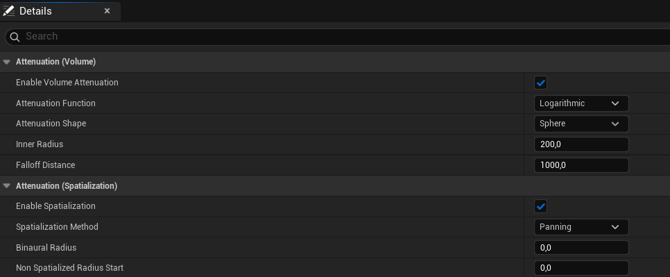
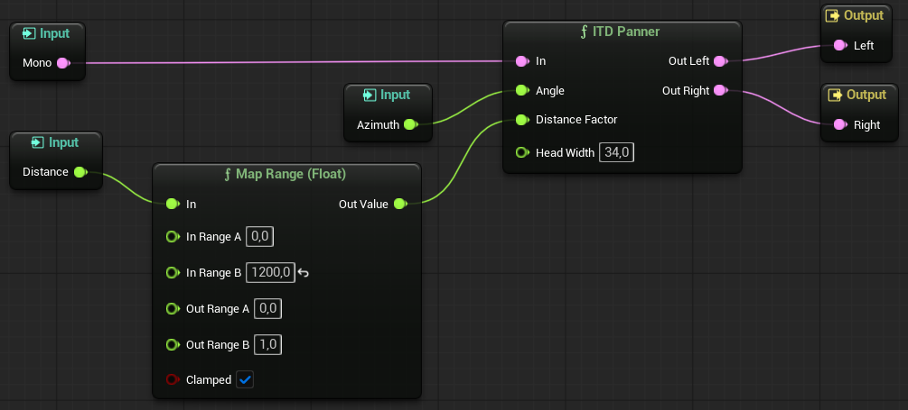

# Farnell in Unreal Engine MetaSound, <small>di Matteo Mangioni</small>

Questo documento fornisce un'overview generale del progetto di Matteo Mangioni per il corso di *Procedural and Spatial Sound* dell'Università degli Studi di Milano, erogato nell'anno accademico 2025/26 dal Prof. Federico Avanzini.
Tale progetto è consistito nell'utilizzo del motore di gioco **Unreal Engine 5** (v. 5.7.4) per la creazione di una scena 3D interattiva popolata unicamente da suoni procedurali generati tramite **MetaSound**, il plugin di *Digital Signal Processing* integrato nel suddetto engine.
I suoni introdotti sono stati adattati da alcuni esempi di generazione sonora pubblicati da Andy Farnell nel suo libro *"Designing Sound"*: in particolare, vengono riproposti il suono del **vento**, del **fuoco**, di uno sciame di **insetti** e dei **passi** del giocatore.

I file sorgenti del progetto, così come il suo eseguibile, sono disponibili pubblicamente al seguente indirizzo: [https://github.com/matmangio/procedural_sound_project](https://github.com/matmangio/procedural_sound_project).

## MetaSound

Come già accennato, MetaSound è un plugin per Unreal Engine 5 che mette a disposizione degli sviluppatori un grafo di Digital Signal Processing (DSP) per la creazione di audio procedurale.
Si tratta di un sistema fortemente integrato con il resto della simulazione di gioco, cosa che permette di generare suoni realistici e reattivi alle diverse situazioni di gameplay.

Ogni sorgente sonora è rappresentata da una **MetaSound Source** (MSS), un grafo DSP indipendente che descrive come generare tale suono e dotato di una serie di input e output: essi possono essere predefiniti (es. gli output audio *Stereo Left* e *Stereo Right*) oppure creati appositamente dal sound designer per essere collegati ad altri elementi del mondo di gioco (es. un input per la velocità di camminata dell'avatar giocante, utile per la generazione del suono dei suoi passi).
Inoltre, similmente alle *abstractions* di PureData, le **MetaSound Patch** (MSP) permettono di racchiudere sotto-grafi all'interno di nodi custom così da permettere una semplice replicazione delle funzionalità.
Sempre su tale falsariga è poi interessante notare che, seguendo la filosofia fortemente object-oriented di Unreal Engine per cui quasi ogni asset è una classe o un'istanza di una classe, Metasound permette la definizione di **interfacce** per le sorgenti sonore: queste possono contenere input e output aggiuntivi e/o logica predefinita.
Considerando per esempio l'interfaccia di default `UE.Spatialization` (ampiamente utilizzata nel progetto), essa introduce gli input `Azimuth` ed `Elevation`, che vengono popolati automaticamente man mano che il giocatore cambia il suo orientamento rispetto alla sorgente sonora.

Continuando con le similarità con PureData, poi, MetaSound è in grado di gestire numerosi tipi di dati in aggiunta ai soli segnali audio: questi includono tipi numerici quali `Float`, `Int32` e `Bool`, ma anche `Trigger`, segnali di controllo affini ai messaggi di PureData in grado di modificare il flusso di computazione.
In particolare, tali trigger vengono valutati a livello di sample, cosicché è possibile adattare la generazione sonora istantaneamente senza dover attendere la conclusione del blocco audio corrente.

### Da PureData a Metasound

Sebbene disponga di una notevole gamma di nodi e filtri predefiniti, Metasound è ad oggi un DSP nettamente più acerbo di PureData.
Per riprodurre fedelmente i grafi proposti da Farnell è stato dunque necessario ampliare le funzionalità di Metasound tramite la creazione di un apposito **plugin** (il cui sorgente è consultabile nella directory *SoundProject/Plugins/MetasoundExtras/Source*).
In particolare, la seguente tabella indica gli oggetti di PureData che sono stati trasposti assieme al loro nome in Metasound e ad eventuali note.

|Oggetto PureData|Nodo Metasound|Note|
|----------------|---------------------|----|
|`bp~`|`Band-pass Filter`|L'unico filtro passa-banda disponibile nativamente in Metasound è un filtro Bi-quad dall'effetto considerevolmente differente.|
|`cos` e `cos~`|`Cos (Float)` e `Cos (Audio)`|Sebbene PureData utilizzi in realtà un'approssimazione polinomiale del coseno, questa non è stata riprodotta optando invece per l'uso della funzione `std::cos()`.|
|`/~`|`Divide (Audio)`|Il nodo Divide di Metasound funziona solo su dati Float, dunque è stato necessario crearne una versione separata per i flussi audio.|
|`line~`|`Line` e `Line (with target)`|I due nodi rappresentano due versioni leggermente diverse del nodo, dove la seconda è più configurabile della prima e non necessita di un Trigger per essere azionata.|
|`rzero~`|`One-Zero Filter`||
|`vcf~`|`Vcf Filter`|Metasound non ha un filtro voltage-controlled risonante nativo, e specialmente non uno che accetti la frequenza come segnale audio a sample-rate.|
|`wrap~`|`Wrap`||

### Spazializzazione

Per permettere un ascolto più interattivo dei suoni procedurali proposti è stata poi creata una scena 3D entro cui l'utente potesse muoversi, realizzata dall'assemblaggio di numerosi asset grafici ottenuti gratuitamente sullo store [Fab](https://www.fab.com/) di Unreal Engine.
Nonostante non si trattasse del focus del progetto, ciò ha quindi richiesto un certo grado di **spazializzazione** dell'audio generato.
Ciò è stato realizzato tramite la combinazione di due componenti:

- **Sound Attenuation**, asset di Unreal Engine che, assegnati a una sorgente sonora, definiscono come attenuarne il suono in base alla distanza dall'avatar giocante e come farne il panning stereo.

	

- **ITD Panning**, una MetaSound Patch personalizzata che agisce da wrapper per il nodo `ITD Panner`: quest'ultimo, utilizzando l'Azimuth del suono e la sua Distanza dall'avatar scalata tra 0 e 1 (entrambi dati ottenuti tramite apposite interfacce), applica una pre-spazializzazione al suono replicando l'*Interaural Time Difference*.
	Questa tecnica non è stata però applicata ai suoni "diffusi" che, non potendo essere ridotti a sorgenti semi-puntiformi, avrebbero generato notevoli artefatti uditivi qualora fossero stati spazializzati in tale maniera (sciame di insetti, alcune componenti del vento e il suono dei passi).

	

## Sorgenti sonore

### Vento

### Fuoco

### Insetti

### Passi
