# Farnell in Unreal Engine MetaSound, <small>di Matteo Mangioni</small>

Questo documento fornisce un'overview generale del progetto di Matteo Mangioni per il corso di *Procedural and Spatial Sound* dell'Università degli Studi di Milano, erogato nell'anno accademico 2025/26 dal Prof. Federico Avanzini.
Tale progetto è consistito nell'utilizzo del motore di gioco **Unreal Engine 5** (v. 5.7.4) per la creazione di una scena 3D interattiva popolata unicamente da suoni procedurali generati tramite **MetaSound**, il plugin di *Digital Signal Processing* integrato nel suddetto engine.
I suoni introdotti sono stati adattati da alcuni esempi di generazione sonora pubblicati da Andy Farnell nel suo libro *"Designing Sound"*: in particolare, vengono riproposti il suono del **vento**, del **fuoco**, di uno sciame di **insetti** e dei **passi** del giocatore.

I file sorgenti del progetto, così come il suo eseguibile, sono disponibili pubblicamente al seguente indirizzo: [https://github.com/matmangio/procedural_sound_project](https://github.com/matmangio/procedural_sound_project).

## MetaSound

Come già accennato, MetaSound è un plugin per Unreal Engine 5 che mette a disposizione degli sviluppatori un grafo di Digital Signal Processing (DSP) per la creazione di audio procedurale.
Si tratta di un sistema fortemente integrato con il resto della simulazione di gioco, cosa che permette di generare suoni realistici e reattivi alle diverse situazioni di gameplay.

Ogni sorgente sonora è rappresentata da una **MetaSound Source** (MSS), un grafo DSP indipendente che descrive come generare tale suono e dotato di una serie di input e output: essi possono essere predefiniti (es. gli output audio *Stereo Left* e *Stereo Right*) oppure creati appositamente dal sound designer per essere collegati ad altri elementi del mondo di gioco (es. un input per la velocità di camminata dell'avatar giocante, utile per la generazione del suono dei suoi passi).
Inoltre, similmente alle *abstractions* di PureData, le **MetaSound Patch** (MSP) permettono di racchiudere sotto-grafi all'interno di nodi custom così da permettere una semplice replicazione delle funzionalità.
Sempre su tale falsariga è poi interessante notare che, seguendo la filosofia fortemente object-oriented di Unreal Engine per cui quasi ogni asset è una classe o un'istanza di una classe, Metasound permette la definizione di **interfacce** per le sorgenti sonore: queste possono contenere input e output aggiuntivi e/o logica predefinita.
Considerando per esempio l'interfaccia di default `UE.Spatialization` (ampiamente utilizzata nel progetto), essa introduce gli input `Azimuth` ed `Elevation`, che vengono popolati automaticamente man mano che il giocatore cambia il suo orientamento rispetto alla sorgente sonora.

Continuando con le similarità con PureData, poi, MetaSound è in grado di gestire numerosi tipi di dati in aggiunta ai soli segnali audio: questi includono tipi numerici quali `Float`, `Int32` e `Bool`, ma anche `Trigger`, segnali di controllo affini ai messaggi di PureData in grado di modificare il flusso di computazione.
In particolare, tali trigger vengono valutati a livello di sample, cosicché è possibile adattare la generazione sonora istantaneamente senza dover attendere la conclusione del blocco audio corrente.

### Da PureData a Metasound

Sebbene disponga di una notevole gamma di nodi e filtri predefiniti, Metasound è ad oggi un DSP nettamente più acerbo di PureData.
Per riprodurre fedelmente i grafi proposti da Farnell è stato dunque necessario ampliare le funzionalità di Metasound tramite la creazione di un apposito **plugin** (il cui sorgente è consultabile nella directory *SoundProject/Plugins/MetasoundExtras/Source*).
In particolare, la seguente tabella indica gli oggetti di PureData che sono stati trasposti assieme al loro nome in Metasound e ad eventuali note.

|Oggetto PureData|Nodo Metasound|Note|
|----------------|---------------------|----|
|`bp~`|`Band-pass Filter`|L'unico filtro passa-banda disponibile nativamente in Metasound è un filtro Bi-quad dall'effetto considerevolmente differente.|
|`cos` e `cos~`|`Cos (Float)` e `Cos (Audio)`|Sebbene PureData utilizzi in realtà un'approssimazione polinomiale del coseno, questa non è stata riprodotta optando invece per l'uso della funzione `std::cos()`.|
|`/~`|`Divide (Audio)`|Il nodo Divide di Metasound funziona solo su dati Float, dunque è stato necessario crearne una versione separata per i flussi audio.|
|`line~`|`Line` e `Line (with target)`|I due nodi rappresentano due versioni leggermente diverse del nodo, dove la seconda è più configurabile della prima e non necessita di un Trigger per essere azionata.|
|`rzero~`|`One-Zero Filter`||
|`vcf~`|`Vcf Filter`|Metasound non ha un filtro voltage-controlled risonante nativo, e specialmente non uno che accetti la frequenza come segnale audio a sample-rate.|
|`wrap~`|`Wrap`||

### Spazializzazione

Per permettere un ascolto più interattivo dei suoni procedurali proposti è stata poi creata una scena 3D entro cui l'utente potesse muoversi, realizzata dall'assemblaggio di numerosi asset grafici ottenuti gratuitamente sullo store [Fab](https://www.fab.com/) di Unreal Engine.
Nonostante non si trattasse del focus del progetto, ciò ha quindi richiesto un certo grado di **spazializzazione** dell'audio generato.
Ciò è stato realizzato tramite la combinazione di due componenti:

- **Sound Attenuation**, asset di Unreal Engine che, assegnati a una sorgente sonora, definiscono come attenuarne il suono in base alla distanza dall'avatar giocante e come farne il panning stereo.

	

- **ITD Panning**, una MetaSound Patch personalizzata che agisce da wrapper per il nodo `ITD Panner`: quest'ultimo, utilizzando l'Azimuth del suono e la sua Distanza dall'avatar scalata tra 0 e 1 (entrambi dati ottenuti tramite apposite interfacce), applica una pre-spazializzazione al suono replicando l'*Interaural Time Difference*.
	Questa tecnica non è stata però applicata ai suoni "diffusi" che, non potendo essere ridotti a sorgenti semi-puntiformi, avrebbero generato notevoli artefatti uditivi qualora fossero stati spazializzati in tale maniera (sciame di insetti, alcune componenti del vento e il suono dei passi).

	

## Sorgenti sonore

I prossimi paragrafi illustrano i metodi di generazione sonora delle diverse sorgenti presenti nel progetto, mutuati come già accennato da "Designing Sound" di Andy Farnell: per motivi di brevità ci si limiterà a descriverne il funzionamento ad alto livello, mentre per i dettagli implementativi più specifici si rimanda a tale testo.
La figura sottostante mostra a grandi linee come tali suoni siano posizionati all'interno della scena 3D: si noti però che sebbene siano indicati solo pochi alberi, il suono delle foglie viene in realtà istanziato su ogni pianta presente nella scena.

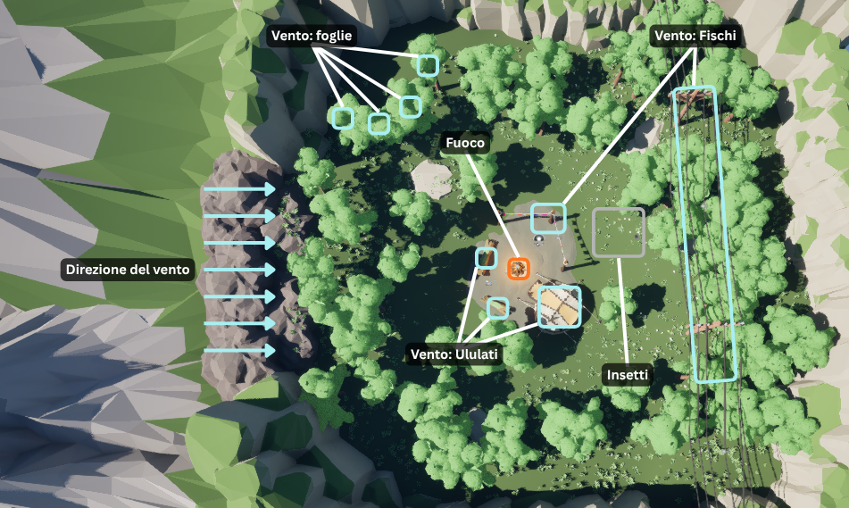

### Vento

Per comprendere come generare il suono del **vento** è necessario innanzitutto capire che il vento, di per sé, non emette alcun rumore: si tratta invece di un suono "composito" formato dalla somma di rumori generati dall'interazione di vari oggetti con le masse d'aria in movimento.

#### Velocità del vento

Poiché ciascuna delle componenti sonore che intendiamo creare è modulata dalla **velocità del vento**, è necessario innanzitutto modellare tale segnale: si tratterà di un segnale audio compreso tra 0 e 1, così da evitare complicazioni date dall'uso di complicate unità di misura.

Per fare ciò si parte da una semplice sinusoide con frequenza di 0.1 Hz, spostata e scalata per oscillare nel range [0, 0.5].
Essendo il suo andamento fin troppo regolare per simulare efficacemente la natura caotica del vento, il rimanente range di 0.5 viene riempito da due elementi:

- **Raffiche**: preso un rumore bianco opportunamente filtrato per ridurne la frequenza attorno ai 0.5 Hz, questo viene moltiplicato per una versione scalata della sinusoide di base in modo tale che la presenza di raffiche aumenti in modo quadratico maggiore è la velocità del vento.

- **Bufere**: del tutto simili alle raffiche, questi eventi avvengono con una frequenza maggiore, attorno ai 3 Hz.
	Tuttavia, un'operazione di `max` sulla sinusoide di base fa sì che tale rumore sia udibile solamente quando la velocità base del vento è superiore a 0.4.

La somma di queste componenti viene riportata nel range [0, 1] e costituisce la velocità finale.
Poiché tale velocità è come detto necessaria a modulare tutti gli elementi del vento, i quali però per motivi di spazializzazione dovranno risiedere in diverse MetaSound Source, il suo grafo viene raccolto in una MetaSound Patch avente come input i seed dei rumori bianchi di raffiche e bufere: in questo modo è possibile assicurarsi che diverse istanze di tale patch generino sempre il medesimo segnale.

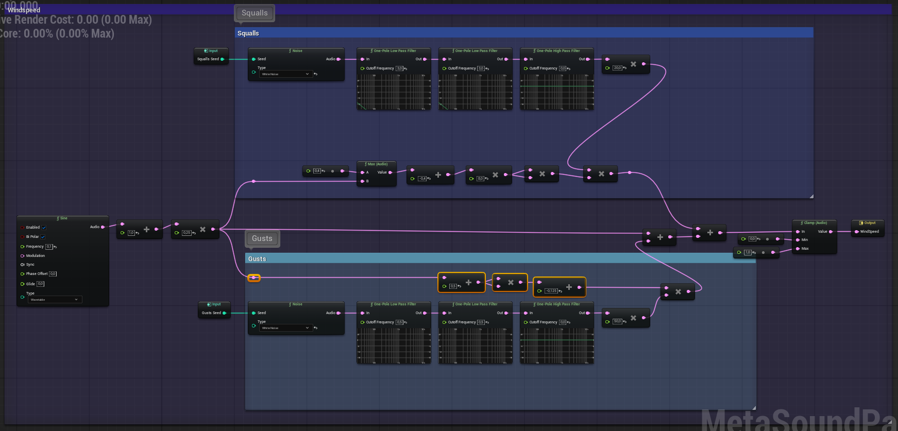

#### Grandi ostacoli

La prima componente del vento è data dagli **ostacoli di grandi dimensioni**: quando l'aria si muove parallelamente alla loro superficie, le microscopiche irregolarità su di essa agiscono come casse di risonanza e generano un rumore colorato la cui intensità dipende dalla velocità del vento.
Ciò viene reso con un filtro Passa-Banda centrato sugli 800 Hz; inoltre, alla velocità del vento viene sommato 0.2 per far sì che questo rumore di background sia sempre presente.
Il passaggio del segnale così ottenuto attraverso un filtro One-Zero il cui coefficiente è modulato anch'esso dalla velocità del vento aggiunge un notch che rende il suono più dinamico.

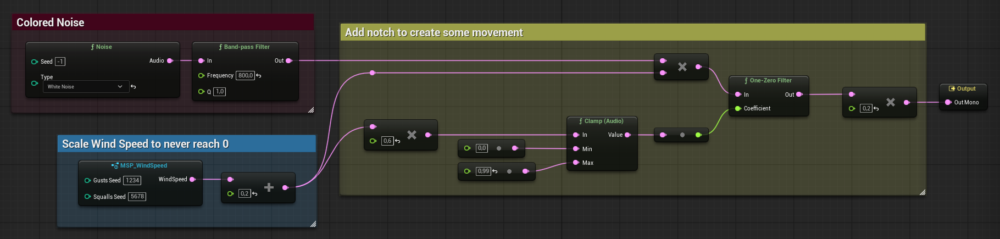

Poiché tale suono non è posizionato nella scena ma agisce invece da ambience sempre presente, la sua MetaSound Source viene istanziata come suono 2D all'inizio della simulazione.

#### Fischi

Se gli ostacoli di grandi dimensioni generano il rumore di fondo di cui abbiamo appena parlato, oggetti più piccoli come pali o fili generano invece **fischi** noti come *"aeolian noise"* in virtù del moto oscillatorio che generano nell'aria.
Presa la velocità del vento opportunamente ritardata per tenere conto della distanza dalla sua sorgente (input `Delay`), questo fischio viene realizzato passando del rumore bianco attraverso un filtro passa-banda risonante la cui frequenza centrale è modulata dalla velocità del vento e compresa tra i valori di input `MinFrequency` e `MaxFrequency` (dipendenti dalla dimensione dell'oggetto).
L'output così ottenuto viene modulato dalla velocità del vento al quadrato, alla quale viene inizialmente aggiunto l'input `MinSpeed` per determinare a partire da quale velocità del vento il fischio diviene udibile.

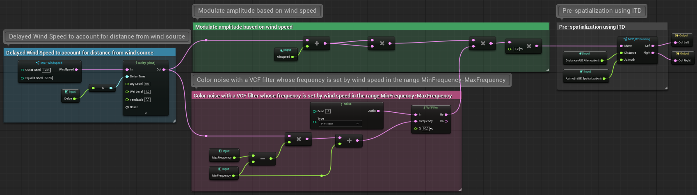

Due tipi di oggetti generano fischi all'interno del progetto: i *pali dei festoni* vicino alla tenda e i *cavi dell'elettricità*.
La seguente tabella riporta i valori degli input per tali elementi.

|Oggetto|Delay|MinFrequency|MaxFrequency|MinSpeed|
|-------|-----|------------|------------|--------|
|Festoni|0.5 s|1000 Hz|2000 Hz|0.0|
|Cavi|1.5 s|600 Hz|1000 Hz|0.12|

#### Ululati

Quando il vento si incanala in uno spazio cavo come una galleria o un tubo, se la sua velocità si trova entro un certo range tale spazio può diventare una cassa di risonanza e generare un basso **ululato** con frequenza fissa che dipende dalle dimensioni dell'ambiente stesso.

Per realizzare tale effetto prendiamo la velocità del vento ritardata tramite l'input `Delay` e la restringiamo tra `MinWindSpeed` e `MaxWindSpeed`, cosicché il suono si annulli se la velocità del vento esce da tale range.
La velocità viene infine filtrata tramite l'uso del coseno e di un filtro Passa-Basso che ne rallentano i cambiamenti, facendo così in modo che gli ululati abbiano una durata di qualche secondo anche quando la velocità del vento cambia molto rapidamente.
L'ululato in sé viene infine ottenuto dall'unione di un rumore bianco filtrato da un filtro Passa-Banda con frequenza centrale `BpFrequency` e una sinusoide con frequenza compresa tra `OscMin` e `OscMax`, la quale modula lo spettro del rumore filtrato a seconda della velocità del vento.

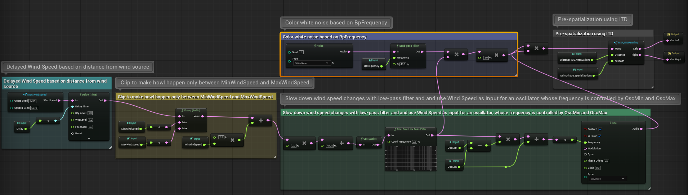

All'interno della scena tre oggetti generano ululati: la *tenda* e i *tronchi cavi* sul terreno vicino ad essa.
La seguente tabella riporta i valori degli input per tali elementi.

|Oggetto|Delay|MinWindSpeed|MaxWindSpeed|BpFrequency|OscMin|OscMax|
|-------|-----|------------|------------|-----------|------|------|
|Tenda|0.35 s|0.25|0.5|200 Hz|20 Hz|120 Hz|
|Tronco 1|0.3 s|0.35|0.6|400 Hz|30 Hz|230 Hz|
|Tronco 2|0.27 s|0.4|0.65|380 Hz|60 Hz|320 Hz|

#### Foglie

L'ultima componente del vento è il fruscio delle **foglie** degli alberi.
Questo viene generato prendendo la velocità del vento e ritardandola in base alla distanza dalla sorgente e a un valore randomico che rappresenta la diversa struttura di ciascun singolo albero, i cui rami offrono alle foglie una certa inerzia nel movimento; tale inerzia è poi ulteriormente rappresentata dal filtraggio della suddetta velocità tramite un filtro Passa-Basso a 0.1 Hz.
Il segnale così ottenuto viene scalato e invertito per poi essere messo in `max` con un rumore bianco: così facendo, quando la velocità del vento è bassa solo pochi picchi di rumore riescono a passare, mentre più essa cresce più il suono si fa potente.
Infine, un paio di filtri colorano il rumore per ottenere il suono desiderato.

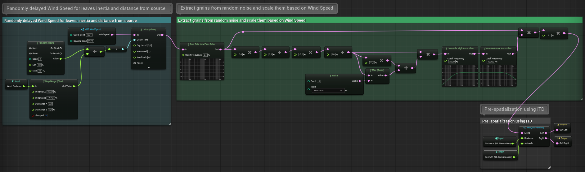

Data l'ingente quantità di alberi presenti nella scena, essi non sono stati piazzati manualmente ma generati tramite lo strumento Foliage di Unreal Engine: tuttavia, ciò non ha permesso di assegnare a ciascuno la MetaSound Source appena discussa.
Quando il progetto viene avviato, dunque, tali sorgenti vengono istanziate nella posizione di tutti gli alberi, posizione che viene inoltre usata per popolare l'input `WindDistance`.

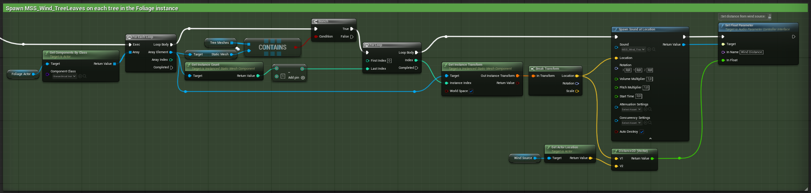

### Fuoco

Come il suono del vento, anche il suono del **fuoco** è dato dalla somma di diversi eventi sonori che hanno luogo durante la combustione, ognuno dei quali viene generato tramite il filtraggio di un rumore bianco (sintesi sottrattiva).
In particolare, poiché tali componenti sono intrinsecamente legati dalla medesima reazione chimica, è possibile usare la medesima fonte di rumore per ciascuno di essi, donando così maggiore coerenza al suono.
Nelle seguenti figure, dunque, i segnali audio provenienti da sinistra sono collegati allo stesso generatore di rumore bianco, mentre i segnali uscenti a destra sono infine sommati e formano il suono completo.

#### Sibili

Il primo suono che è possibile udire nel fuoco è il **sibilo** dato dai vapori e dai gas che, riscaldati dalla combustione, emergono dalle fiamme: il loro suono può essere facilmente generato filtrando il rumore con un filtro Passa-Alto a 1000 Hz.
Tuttavia, tali sibili sono tipicamente infrequenti e intramezzati da momenti di silenzio: per ottenere tale effetto li moduliamo usando il rumore bianco passato per un filtro Passa-Basso a 1 Hz e poi elevato alla quarta (e opportunamente scalato) per rendere i sibili più improvvisi e potenti.

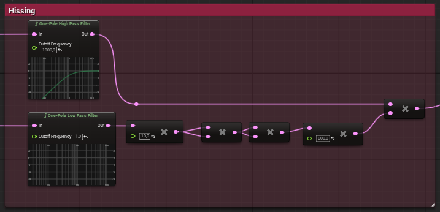

#### Scoppiettii

La seconda componente del suono del fuoco sono gli **scoppiettii** che si hanno quando un pezzo di combustibile esplode a causa dell'elevata pressione data dall'aumento di temperatura.
Per ottenere tale effetto è innanzitutto necessario generare la frequenza di tali scoppi: ciò può essere fatto filtrando il rumore bianco con un filtro Passa-Basso a 1 Hz e calcolandone il valore di RMS, emettendo poi un Trigger quando esso si trova tra 50 e 51.
Tale Trigger aziona un nodo `Line`, che salta istantaneamente a 1 e poi decade a 0 in un tempo compreso tra 0.01 e 0.03 secondi: il valore di tale nodo sarà elevato alla quarta e infine usato per modulare il suono finale, donandogli così un andamento parabolico.
A tal proposito, tale suono viene ottenuto filtrando l'usuale rumore bianco con un filtro Passa-Banda centrato in una frequenza randomica tra 100 e 1000 Hz: questo rende il tono di ogni scoppio unico, contribuendo al realismo del suono generato.

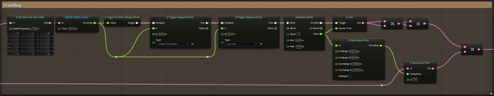

#### Fiamme

L'ultimo elemento è il suono delle **fiamme** stesse, dato dalla combustione dei gas e dalla risonanza del tubo d'aria che il cambio di pressione genera sul fronte di combustione.
Questo suono si ottiene ponendo in sequenza un filtro Passa-Banda e un paio di filtri Passa-Alto che rimuovono le componenti più basse; inoltre, un'operazione di clipping dell'audio evita che l'effetto diventi troppo rumoroso.

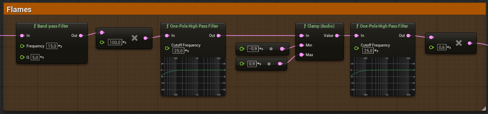

### Insetti

Parlare in generale di suono di **insetti** è improprio, in quanto ciascuna specie di insetto genera ovviamente suoni completamente diversi, la cui natura è data dal meccanismo usato per la generazione sonora e dalla fisiologia del singolo esemplare.
In questo progetto si è deciso di implementare uno **sciame di mosche**, che può essere ascoltato nella zona d'erba immediatamente oltre i pali con festoni.

#### Ali

Partiamo dal realizzare l'approssimazione polinomiale a pezzi di una curva che descrive il movimento dell'**ala** di una singola mosca nel dominio tempo-ampiezza.
Per farlo prendiamo un dente di sega con frequenza data dall'input `WingFrequency` (*frequenza di battito*), lo scaliamo e lo incliniamo tramite una serie di operazioni di minimo.
Separiamo poi i battiti verso l'alto e quelli verso il basso, ovvero le semi-fasi positive e negative: le prime vengono elevate alla quarta e scalate, mentre le seconde vengono sommate a una propria copia modulata con l'input `WingResonance` (*frequenza di risonanza dell'ala*) e poi passata attraverso un coseno.
Sommiamo infine le due componenti e le passiamo attraverso un filtro Passa-Alto con frequenza di taglio di 700 Hz per raffinare l'approssimazione.

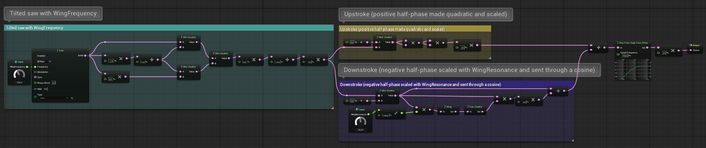

#### Mosca

Per generare il suono di una singola **mosca** vengono usate due ali nella forma appena descritta e due sorgenti di rumore bianco, usate per aggiungere variazioni alle forme d'onda descritte nel paragrafo precedente.
Di queste, la prima viene modulata a 4 Hz con un filtro Passa-Basso di secondo ordine e il suo output viene utilizzato per modificare la `WingFrequency` delle due ali attorno ai 220 Hz: tuttavia, per aggiungere una certa dose di varianza la frequenza di una delle due ali viene ulteriormente sommata a un prodotto intermedio dell'altra sorgente di rumore.
A tal proposito, il secondo generatore di rumore viene similmente filtrato a 5 Hz e scalato per descrivere la `WingResonance`, uguale per le due ali.

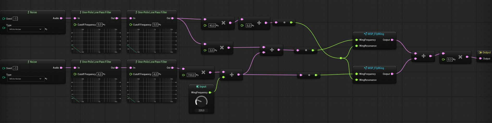

#### Sciame

Descritto il rumore di una singola mosca, l'effetto di **sciame** si ottiene sommando un totale di 8 mosche aventi ciascuna una `WingFrequency` di base randomizzata tra i 180 Hz e i 240 Hz.

### Passi

L'ultimo suono procedurale presente nel progetto è quello dei **passi** dell'avatar giocante.
La sua generazione consiste sostanzialmente in due parti: il calcolo della *Ground Response Force*, la curva che descrive la pressione esercitata sul terreno da ciascun passo a partire dalla velocità di camminata, e l'utilizzo di tale curva per la modulazione di una diversa *texture* sonora a seconda del tipo di terreno calpestato (ghiaia o erba).

#### Ground Response Force

Come detto, la **Ground Response Force** funge da segnale di controllo dell'intero suono.
Per generarla bisogna innanzitutto tradurre un singolo valore di velocità di camminata (che consideriamo compreso tra 0 e 1) in due fasi che descrivono quando ciascuno dei due piedi del personaggio giocante tocca terra: a seconda della velocità, infatti, tali curve avranno o meno momenti di sovrapposizione, nonché ampiezze diverse.
Ciò può essere fatto scalando la velocità di camminata nel range [0, 3] e usandola come frequenza di un fasore, il cui output viene poi modificato usando l'inverso della velocità di camminata e il suo reciproco per generare la fase del piede destro, mentre quella del piede sinistro viene creata nella medesima maniera previo un offset di 180°.
Vengono inoltre aggiunti dei controlli che annullano entrambe le curve qualora la velocità di camminata sia nulla; un filtro Passa-Basso a 1 Hz su quello stesso parametro ne rallenta poi eventuali salti repentini.

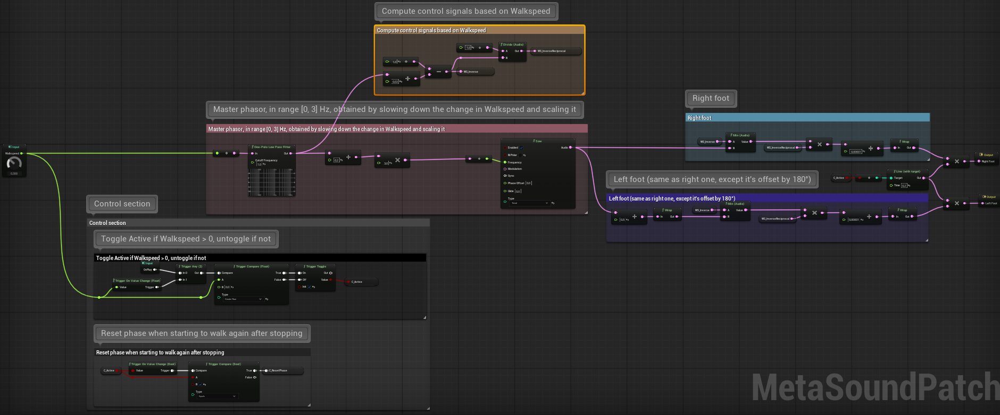

Ottenute due curve che descrivono il tempo di appoggio di ciascun piede, esse devono poi essere trasformate nelle GRF vere e proprie.
Ciò viene fatto tramite l'approssimazione polinomiale delle GRF empiriche, le quali evidenziano tre momenti del passo: il contatto del tallone (**heel**), che essendo la parte più rigida del piede e la prima a toccare il terreno genera l'impatto maggiore, la rotazione del piede (**roll**), in cui il peso viene trasferito sulla pianta, e il contatto della punta (**ball**), che dona ai passi il loro caratteristico suono in due colpi.
Ciascuno di questi tre momenti può essere rappresentato sotto forma di curva tramite la cubica `1.5 * (1 - x)(n * x^3 - n * x)`, dove *n* è un coefficiente che dipende dalla fase di contatto rappresentata (e dalla velocità di movimento) e *x* è il valore del fasore generato in precedenza: tale curva è calcolata nel progetto mediante la patch *MSP_Walk_PolyApproximation*.
Tuttavia, perché la forza di contatto venga generata correttamente, il valore della *x* deve essere clippato in maniera differente per ciascuna fase in modo tale da limitare la rispettiva curva alle porzioni del contatto in cui essa è effettivamente coinvolta.
La somma delle tre funzioni così ottenute costituisce il valore finale della Ground Response Force.

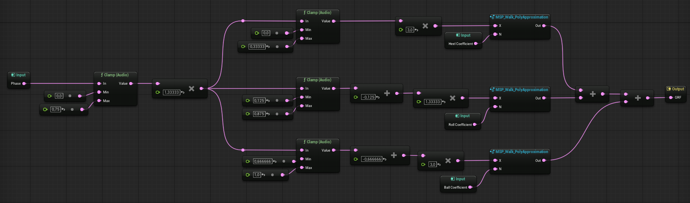

#### Superfici

Una volta generata la GRF di ciascun piede, queste possono essere passate alle texture sonore che rappresentano le diverse **superfici** calpestabili.
Come già accennato, in questo progetto sono presenti due tipi di superficie: la **ghiaia** (1a figura) e l'**erba** (2a figura).
Si tratta in entrambi i casi di *sintesi granulare* in cui, dato del rumore bianco, questo viene filtrato in parallelo e il risultato di tali filtri diviso l'uno per l'altro, generando così un segnale avente grandi escursioni di valore che viene poi ulteriormente scalato per generare dei *grani localizzati temporalmente*.
La somma di questi eventi sonori viene quindi passata attraverso un filtro Passa-Banda risonante la cui frequenza di risonanza è data dalla GRF, la quale modula inoltre il suono ottenuto.
Infine, un input `TextureType` seleziona il tipo di terreno su cui si sta camminando, annullando l'effetto dell'altra texture.

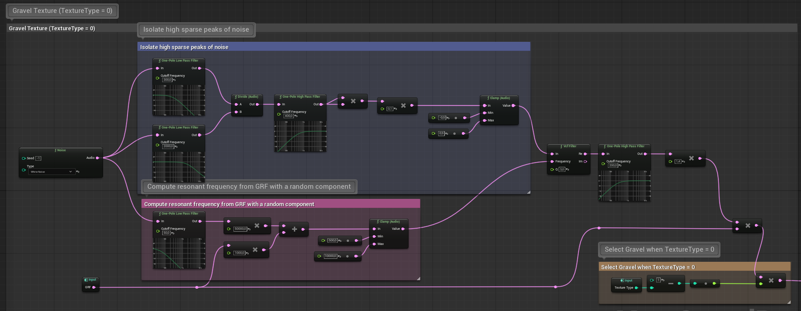

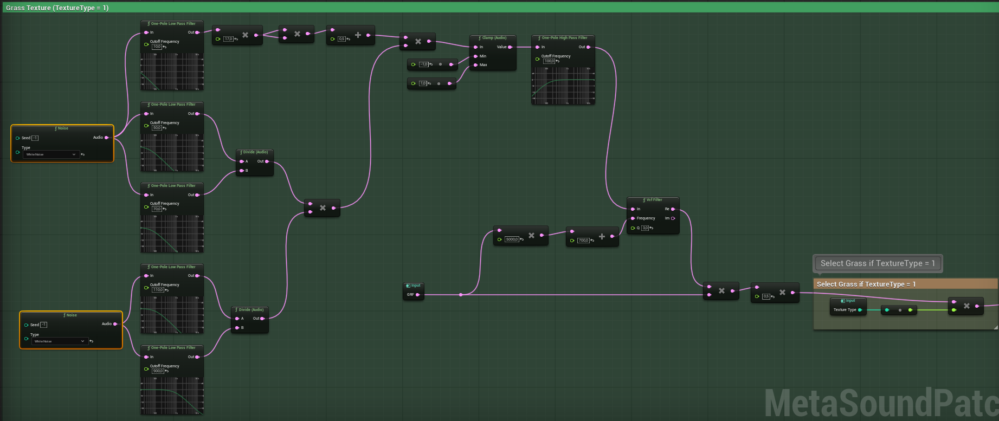

#### Collegamento all'avatar

Per rendere il suono dei passi reattivo ai movimenti del giocatore i parametri principali della sua generazione, vale a dire la velocità di camminata e il tipo di superficie calpestata, vengono aggiornati in tempo reale.
In particolare, a ogni frame viene calcolata la velocità corrente del personaggio, mappata sul range [0, 0.3] e inviata alla MetaSound Source come parametro `Walkspeed`.
Viene poi controllato il tipo di terreno su cui l'avatar si trova, popolando il parametro `TextureType` della stessa MetaSound Source di conseguenza: 0 per la ghiaia, 1 per l'erba.

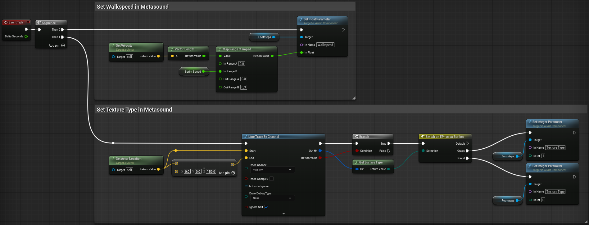
